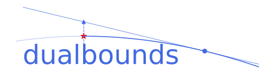

Introduction
============

``dualbounds``  is a python implementation of the dual bounds methodology, a framework for performing inference on partially identified causal estimands (and certain identified estimands as well).

In randomized experiments, dual bounds can wrap around any machine learning algorithm to provide provably valid inference, even if the underlying ML model is misspecified or inconsistent. When applied to observational data, dual bounds also have strong double-robustness guarantees.

Citation
========

If you ``dualbounds`` in an academic publication, please consider citing our paper:

Bibtex entry::

 @misc{ji_lei_spector_2023,
      title={Model-Agnostic Covariate-Assisted Inference on Partially Identified Causal Effects}, 
      author={Wenlong Ji and Lihua Lei and Asher Spector},
      year={2023},
      eprint={2310.08115},
      archivePrefix={arXiv},
      primaryClass={econ.EM},
      url={https://arxiv.org/abs/2310.08115},
 }

.. toctree::
   :caption: Getting started
   :hidden:

   installation.rst
   quickstart.ipynb

.. toctree::
   :caption: Tutorials
   :hidden:

   tutorials.ipynb

.. toctree::
   :caption: API Reference
   :hidden:

   apiref.rst
   api_bootstrap.rst

Index
=====

* :ref:`genindex`
* :ref:`modindex`